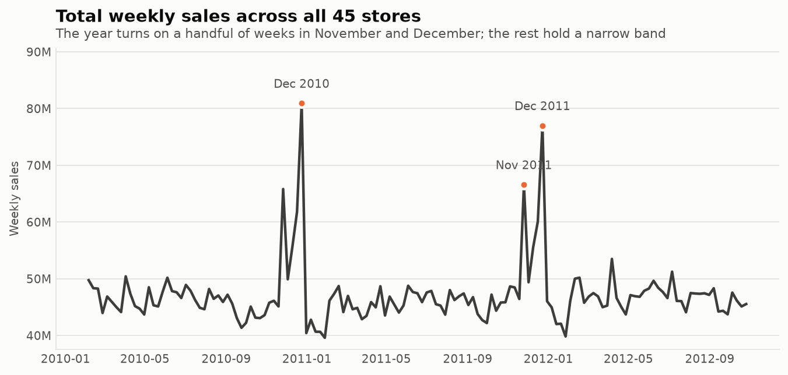
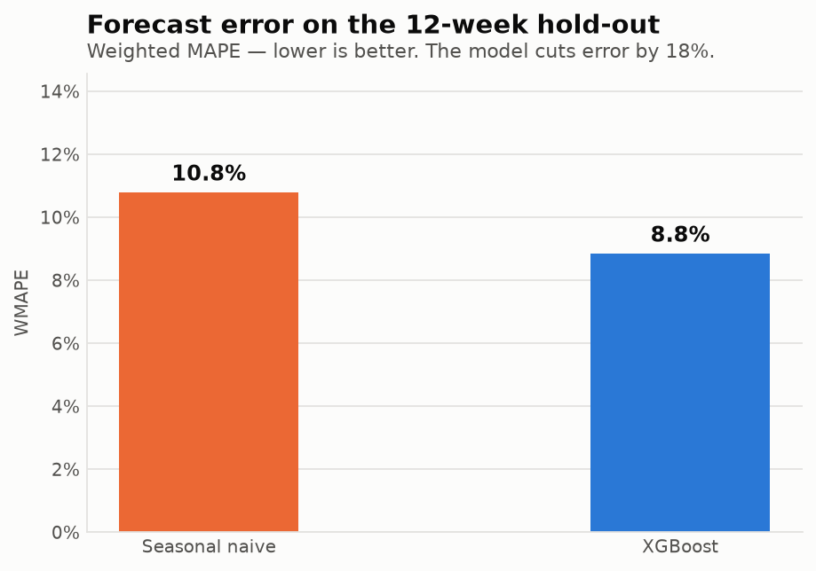
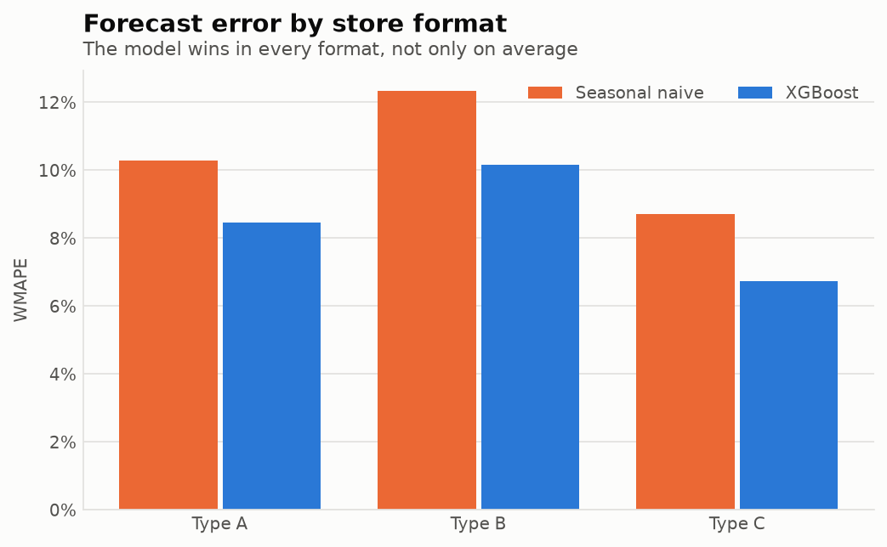
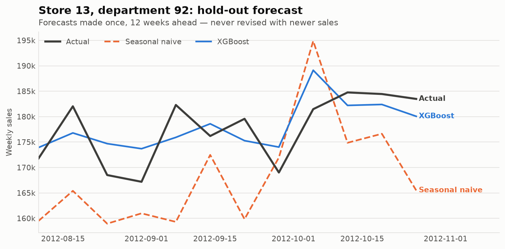
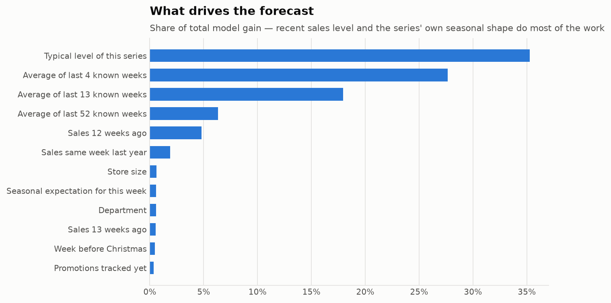

# Weekly demand forecasting for a 45-store retail chain

A worked case study: replacing "order what we sold last year" with a forecast that
cuts planning error by 18%.

---

## The problem

A retail chain of 45 stores places orders roughly a quarter ahead. Across 81
departments per store, that is more than three thousand separate ordering decisions
every week, each one made without a demand forecast.

In practice a planner falls back on the one method that needs no system: look up what
this department sold in the same week last year, and order that. It is a sensible
rule and it works reasonably well most of the year.

It fails where it costs the most. The chart below is the whole commercial problem in
one picture — ordinary weeks hold a narrow band, and then a handful of weeks in
November and December carry a disproportionate share of the year.

In those weeks an under-order is an empty shelf during the only period that really
matters, and an over-order is a warehouse of stock to be discounted in January. Last
year's figure is a weak guide precisely there, because it carries forward last year's
own mistakes, last year's promotions, and last year's weather.

## The approach

The question was framed the way the business actually faces it:

> Standing at the end of the available history, forecast the next twelve weeks of
> demand for every store and department.

Twelve weeks is the planning lead time. That single constraint drives the whole
design, and one consequence is worth stating plainly:

**The model is never shown recent sales.** With a twelve-week lead time, the most
recent figure a planner has when placing an order is twelve weeks old — so the model
gets nothing fresher either. This is the most common way a forecasting demonstration
inflates its own results, and it is prevented here by construction rather than by
good intentions. There is an automated test that erases every hold-out sales figure,
rebuilds the entire feature set, and asserts the model's inputs come out unchanged.

What the model does use:

- each series' own sales history, no fresher than twelve weeks
- its seasonal signature — this department's share of its normal turnover in this
  calendar week, learned from previous years
- the weeks *before* major holidays, not just the holiday weeks, since stock has to
  arrive ahead of the peak
- store format and size, promotional activity, and local economic indicators

One model covers all 3,331 store-department combinations rather than one model per
series. Patterns transfer — a Christmas shape observed in one store informs the same
department elsewhere — and one model is something an operations team can actually
run, monitor and retrain.

The forecast is compared against the planner's current method on the same twelve
weeks, using the same rules.

## The result

Measured on twelve weeks the model never saw, across 35,563 store-department weeks:

| Metric | Current method | Forecast model | Improvement |
|---|---|---|---|
| **WMAPE** (share of volume forecast wrong) | 10.8% | **8.8%** | **18.0% lower** |
| **RMSE** (penalises large misses) | 3,627 | **2,872** | **20.8% lower** |
| **MAE** (average miss, in currency) | 1,682 | **1,379** | **18.0% lower** |
| **Bias** (systematic over/under) | −1.7% | **+0.4%** | near-eliminated |

The bias line is worth reading separately. The current method runs systematically
1.7% low — a structural tendency to under-order that no safety-stock policy corrects,
because the shortfall is built into the plan itself. The model is effectively
unbiased, which changes the *kind* of error left over: noise to be buffered rather
than a lean to be compensated for.

**The result is not an average hiding a weak segment.** The model is more accurate in
all three store formats, in 61 of 80 departments, and in every single one of the
twelve hold-out weeks.

Here is what that looks like for one department:

## What the model relies on

There is nothing exotic here, and that is the point. The model leans on each series'
recent level and its seasonal shape — the same two things an experienced planner
uses. The difference is that it applies them consistently across 3,331 series and
weighs them against each other *per series*, every week, which is the part a person
cannot do by hand.

The external signals — fuel price, unemployment, temperature — contribute very
little. That is a useful thing to know before promising anyone that adding
macroeconomic data will improve their forecast.

## Business impact

The measured result is the 18% error reduction above. What that is worth depends on
each business's cost structure, so the translation is set out as reasoning rather
than as a number to be quoted:

- **Forecast error drives safety stock.** Buffer stock is sized against forecast
  uncertainty. Reducing error by 18% reduces the buffer needed to hold a given
  service level — working capital released without any loss of availability.
- **Eliminating the negative bias attacks stockouts directly.** A method that runs
  1.7% low under-orders systematically across the entire assortment. Removing that
  lean is a different kind of gain from reducing noise, and it lands on lost sales.
- **The largest misses shrink most.** RMSE improved more than MAE (20.8% versus
  18.0%), meaning the big failures — the ones that cause an empty shelf or a
  clearance markdown — are reduced more than routine ones.

Turning these into a currency figure requires the client's holding cost, margin, and
service-level target. That calculation is the first step of an engagement, not
something this case study can honestly assert on their behalf.

## Limitations

Stated deliberately, because a case study that lists none is not credible:

- **Two and a half years of history.** Barely two complete annual cycles — the
  minimum for learning a yearly pattern at all. A third year would likely help more
  than any change to the model.
- **The hold-out window contains no major holiday.** It covers twelve weeks of late
  summer. Accuracy through November and December, where the commercial stakes are
  highest, is not measured here and should not be assumed to match.
- **Departments, not individual articles.** Real ordering happens at article level,
  where series are thinner and noisier. The method carries over; these accuracy
  figures would not.
- **No stock, lead-time or capacity data.** This forecasts demand. Converting demand
  into order proposals additionally needs lead times, minimum order quantities and
  shelf constraints.

---

*Built on a public retail dataset of 45 stores, 81 departments and 143 weeks. Full
code, data-quality checks and leakage tests: see [README.md](README.md).*
